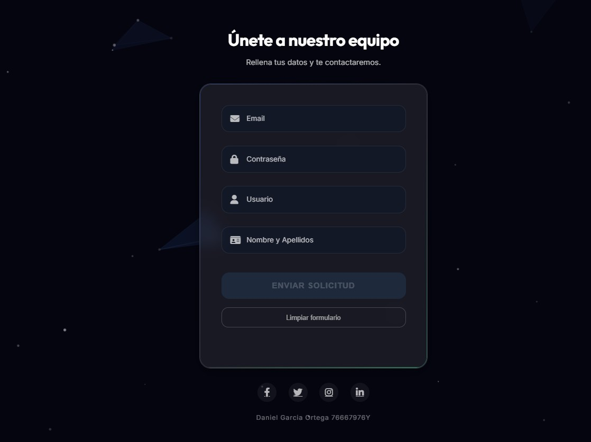
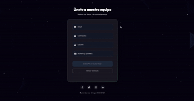

### 📸 Vista del Formulario


### 🎬 Demostración Interactiva

<p align="center">
  
- ✨ **Floating Labels**: Labels que se elevan al escribir
- 🎭 **Animación Shake**: En campos con errores
- 🔵 **Glow Effects**: Resplandor en focus

### Fondo Interactivo

- 55 partículas en movimiento
- Triangulación dinámica cuando están cerca
- Repulsión magnética al mover el mouse
- Efecto "respiración" (pulsing)
- Color basado en la paleta del tema

---

## 📁 Estructura del Proyecto

```
PROYECTOTAREA3/
├── index.html                          # Estructura HTML
├── style.css                           # Estilos (418 líneas)
├── script.js                           # Validación + Canvas (281 líneas)
├── README.md                           # Este archivo
└── DOCUMENTACION_PROYECTOTAREA3.md     # Documentación técnica completa
```

---

## 💻 Tecnologías Utilizadas

### Frontend
- **HTML5**: Estructura semántica
- **CSS3**: Glassmorphism, gradientes, animaciones
- **JavaScript ES6+**: Validación y Canvas API

### Librerías Externas
- **Google Fonts**: Outfit + Inter
- **Font Awesome 6.4**: Iconos

### Técnicas Avanzadas
- Canvas API para animaciones
- CSS Variables (Custom Properties)
- Event Listeners
- Real-time validation
- DOM Manipulation

---

## 🎨 Paleta de Colores

```css
Azul Principal:    #4F73D0
Azul Oscuro:       #1E2A47
Fondo:             #0f172a
Verde Éxito:       #4CCD8A
Naranja Error:     #FF8C6C
```

---

## 🚀 Instalación y Uso

### Clonar el Repositorio

```bash
git clone https://github.com/TU_USUARIO/PROYECTOTAREA3.git
cd PROYECTOTAREA3
```

### Ejecutar Localmente

**Opción 1**: Abrir directamente
```bash
# Abre index.html en tu navegador
start index.html
```

**Opción 2**: Con Live Server (VS Code)
1. Instala la extensión "Live Server"
2. Click derecho en `index.html` → "Open with Live Server"

**Opción 3**: Con Python
```bash
python -m http.server 8000
# Abre http://localhost:8000
```

---

## 📖 Documentación

Para entender en detalle cómo funciona el código:

📄 **[DOCUMENTACION_PROYECTOTAREA3.md](./DOCUMENTACION_PROYECTOTAREA3.md)**

Incluye:
- Análisis completo del código HTML, CSS y JavaScript
- Explicación de cada función paso a paso
- Algoritmo de triangulación del canvas
- Conceptos de glassmorphism
- Tabla de validaciones

---

## 🎓 Conceptos Aplicados

### HTML
- Estructura semántica moderna
- Floating labels pattern
- Inputs con validación HTML5

### CSS
- **Flexbox**: Layout centrado
- **Glassmorphism**: Efecto vidrio con backdrop-filter
- **Gradient Borders**: Usando pseudo-elementos
- **Transitions**: Animaciones suaves
- **CSS Variables**: Paleta centralizada
- **@keyframes**: Animaciones personalizadas

### JavaScript
- **DOM Manipulation**: getElementById, querySelector
- **Event Listeners**: input, click, mousemove
- **Regex Validation**: Email pattern
- **Canvas API**: Animación de partículas
- **Algoritmo de triangulación**: Triple bucle optimizado
- **Interacción mouse**: Cálculo de distancias y fuerzas

---

## 🧪 Validación de Campos

### Email
```javascript
const regexEmail = /^[^\s@]+@[^\s@]+\.[^\s@]+$/;
```

### Contraseña
- Longitud: `val.length >= 5`
- Mayúscula: `/[A-Z]/.test(val)`
- Minúscula: `/[a-z]/.test(val)`
- Número: `/[0-9]/.test(val)`

### Usuario
```javascript
val.length >= 3
```

---

## 🎨 Estilos Destacados

### Efecto Glassmorphism

```css
.glass-effect {
    background: rgba(255, 255, 255, 0.08);
    backdrop-filter: blur(16px);
    border-radius: 24px;
    border: 1px solid rgba(255, 255, 255, 0.1);
    box-shadow: 0 8px 32px rgba(0, 0, 0, 0.37);
}
```

### Floating Label

```css
.floating-input:focus ~ .floating-label {
    top: 8px;
    font-size: 0.75rem;
    color: var(--primary-blue);
}
```

---

## 📊 Rendimiento

- **Tamaño total**: ~23.5 KB (sin CDN)
- **FPS del canvas**: 60 FPS constantes
- **Tiempo de carga**: < 1 segundo
- **Partículas activas**: 55
- **Complejidad triangulación**: O(n³)

---

## 🔧 Mejoras Futuras

- [ ] Integración con backend (Node.js, PHP)
- [ ] LocalStorage para persistencia
- [ ] reCAPTCHA para seguridad
- [ ] Confirmación de contraseña
- [ ] Modo oscuro/claro toggle
- [ ] Animaciones de entrada (fade-in)
- [ ] Barra de progreso del formulario
- [ ] Indicador de fuerza de contraseña
- [ ] Tooltips informativos
- [ ] Soporte multi-idioma

---

## 📱 Responsive Design

El diseño se adapta a diferentes tamaños de pantalla:

- ✅ Desktop (> 768px)
- ✅ Tablet (768px - 480px)
- ✅ Mobile (< 480px)

---

## 🤝 Contribuciones

Las contribuciones son bienvenidas. Si encuentras algún bug o tienes sugerencias:

1. Fork el proyecto
2. Crea una rama (`git checkout -b feature/mejora`)
3. Commit tus cambios (`git commit -m 'Añade nueva funcionalidad'`)
4. Push a la rama (`git push origin feature/mejora`)
5. Abre un Pull Request

---

## 📄 Licencia

Este proyecto es de uso educativo para el curso de Desarrollo de Aplicaciones Web.

---

## 👤 Autor

**Daniel Garcia Ortega**
- **DNI**: 76667976Y
- **Curso**: 1º DAW - Lenguaje de Marcas
- **Fecha**: Noviembre 2025

---

## 📞 Contacto

Si tienes preguntas sobre el proyecto:

- 📧 Email: [tu-email@ejemplo.com](mailto:tu-email@ejemplo.com)
- 💼 LinkedIn: [Tu Perfil](https://linkedin.com/in/tu-perfil)
- 🐙 GitHub: [@TuUsuario](https://github.com/TuUsuario)

---

## ⭐ Dale una Estrella

Si este proyecto te fue útil, ¡dale una estrella! ⭐

---

**Desarrollado con 💙 para el curso de DAW**
